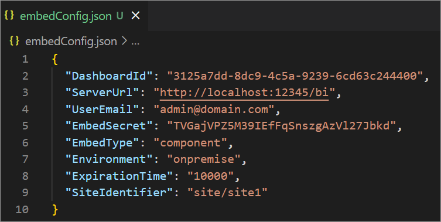

# Bold BI Embedded Sample in Vue.js with Node.js

 This Bold BI Vue.js with Node.js sample contains the Dashboard embedding samples. In this sample Vue.js application act as front-end and Node.js act as back-end application. This application aims to demonstrate how to render the dashboard available on your Bold BI server.

## Dashboard view

## Requirements/Prerequisites

* [Visual Studio Code](https://code.visualstudio.com/download)
* [Node.js](https://nodejs.org/en/)

 > **NOTE:** Node.js v18.17 to v20.15 are supported.

### Supported browsers
  
* Google Chrome, Microsoft Edge, Mozilla Firefox.

## Configuration

* Please ensure you have enabled embed authentication on the `embed settings` page. If it is not currently enabled, please refer to the following image or detailed [instructions](https://help.boldbi.com/site-administration/embed-settings/#get-embed-secret-code?utm_source=github&utm_medium=backlinks) to enable it.

    

* To download the `embedConfig.json` file, please follow this [link](https://help.boldbi.com/site-administration/embed-settings/#get-embed-configuration-file?utm_source=github&utm_medium=backlinks) for reference. Additionally, you can refer to the following image for visual guidance.

     
     

* Copy the downloaded `embedConfig.json` file and paste it into the designated [location](https://github.com/boldbi/vue-with-nodejs-sample/tree/master/Nodejs) within the application. Please ensure you have placed it in the application, as shown in the following image.

    

## Run a Sample Using Command Line Interface

* Open the command line interface and navigate to the specified file [location](https://github.com/boldbi/vue-with-nodejs-sample/tree/master/Nodejs) where the project is located.
  
* To install all dependent packages, use the following command `npm install`.

* Then, run the back-end `Nodejs` sample using the following command `node embed.js`.

* Open the command line interface and navigate to the specified file [location](https://github.com/boldbi/vue-with-nodejs-sample/tree/master/vue) where the project is located.

* To install all dependent packages, use the following command `npm install`.

* Finally, run the application using the following command `npm run serve`. After the application has started, it will display a URL in the command line interface, typically something like (e.g., <http://localhost:8081>). Copy this URL and paste it into your default web browser.

## Developer IDE

* [Visual studio code](https://code.visualstudio.com/download)

### Run a Sample Using Visual Studio Code

* Open the `Nodejs` sample in **Visual Studio Code**.

* To install all dependent packages, use the following command `npm install`.

* Then, run the back-end `Node.js` sample using the following command `node embed.js`.

* Open the `vue` sample in a new window of **Visual Studio Code**.

* To install all dependent packages, use the following command `npm install`.

  * Finally, run the application using the following command `npm run serve`. After the application has started, it will display a URL in the command line interface, typically something like (e.g., <http://localhost:8081>). Copy this URL and paste it into your default web browser.

> **NOTE:** If the API host is already in use, modify the port number per your preference in embed.js and update that App.vue file.

Please refer to the [help documentation](https://help.boldbi.com/embedding-options/embedding-sdk/samples/vuejs-with-node-js/#how-to-run-the-sample?utm_source=github&utm_medium=backlinks) to know how to run the sample.

## Important notes

In a real-world application, it is recommended not to store passwords and sensitive information in configuration files for security reasons. Instead, you should consider using a secure application, such as Key Vault, to safeguard your credentials.

## Online demos

Look at the Bold BI Embedding sample to live demo [here](https://samples.boldbi.com/embed?utm_source=github&utm_medium=backlinks).

## Documentation

A complete Bold BI Embedding documentation can be found on [Bold BI Embedding Help](https://help.boldbi.com/embedded-bi/javascript-based/?utm_source=github&utm_medium=backlinks).
